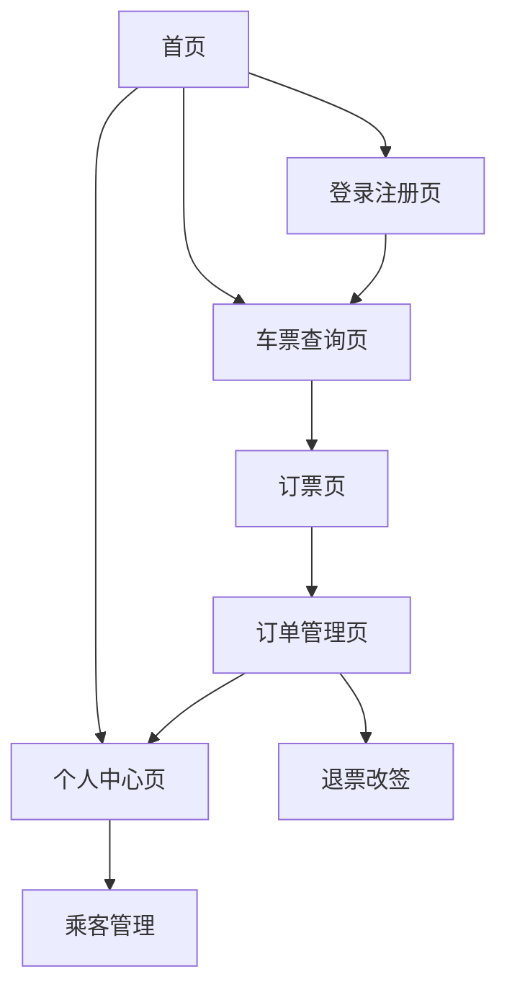
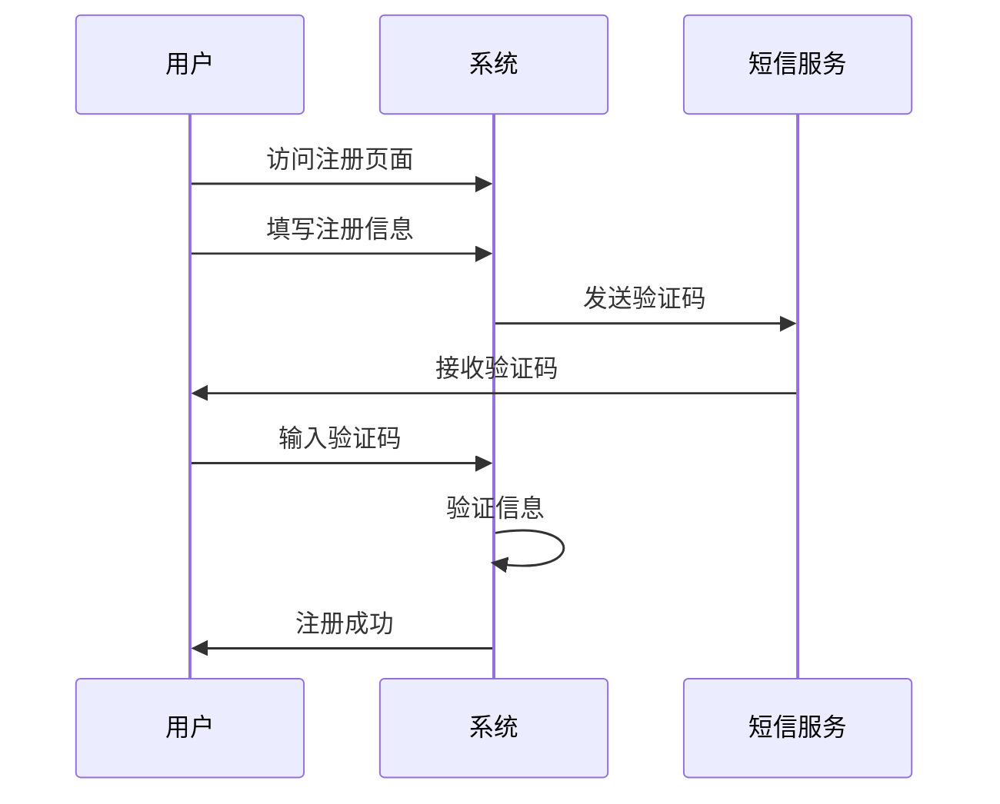
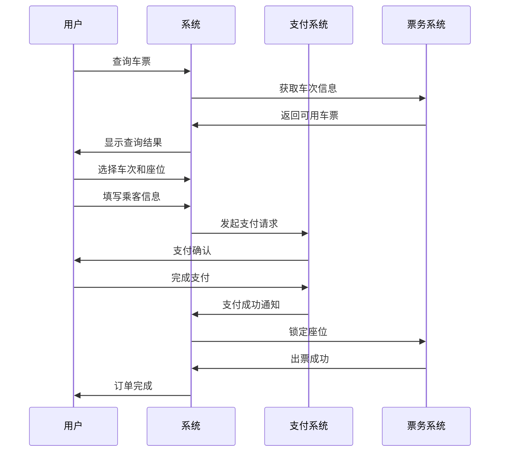
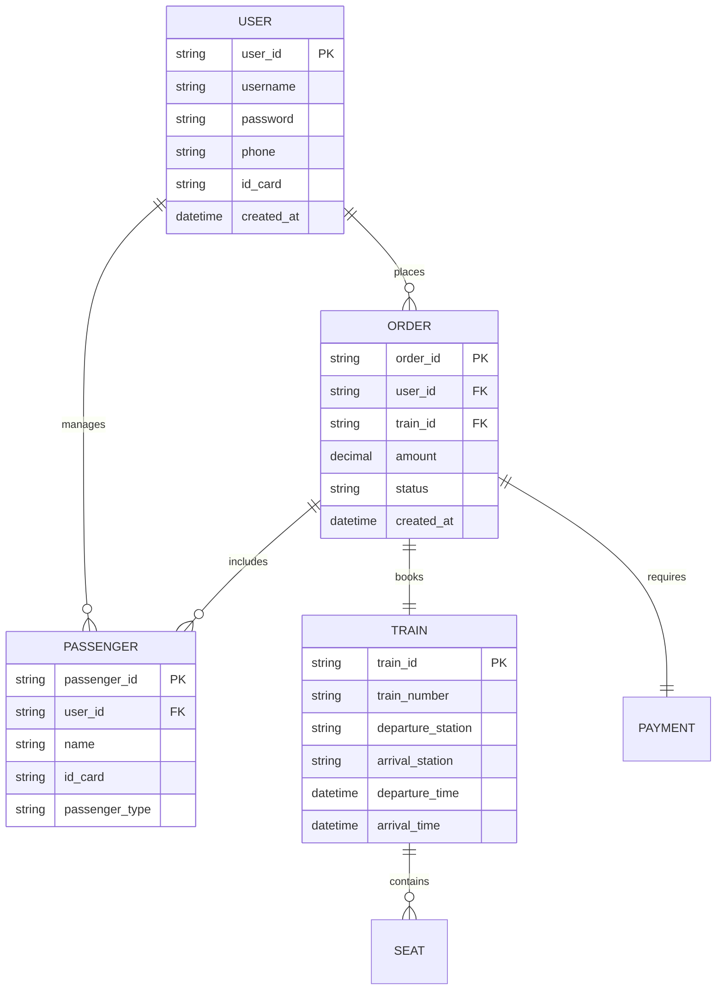

# 12306铁路客票销售系统需求文档

## 1. 系统概述

12306铁路客票销售系统是中国铁路总公司官方的网络购票平台，为广大旅客提供便捷、安全、高效的火车票预订服务。系统主要解决传统购票排队时间长、购票渠道有限等问题，通过互联网技术实现7×24小时在线购票服务。

**目标用户：** 需要购买火车票的普通旅客、商务出行人员、学生群体等
**核心价值：** 提供便民的在线购票服务，提升购票效率，优化用户出行体验

## 2. 功能需求

### 2.1 用户角色

| 角色 | 注册方式 | 核心权限 |
|------|----------|----------|
| 普通用户 | 手机号/身份证注册 | 查询车票、购买车票、管理订单、个人信息维护 |
| VIP用户 | 普通用户升级 | 优先购票、专属客服、积分兑换等增值服务 |
| 管理员 | 系统分配 | 系统管理、数据维护、用户管理、订单处理 |

### 2.2 功能模块

我们的12306系统包括以下主要页面：

1. **首页**：系统导航、快速查询入口、公告信息展示
2. **登录注册页**：用户身份验证、新用户注册
3. **车票查询页**：车次信息查询、余票查询、筛选功能
4. **订票页**：座位选择、乘客信息填写、支付流程
5. **订单管理页**：订单查询、退票改签、订单详情
6. **个人中心页**：个人信息管理、乘客管理、历史订单

### 2.3 页面详情

| 页面名称 | 模块名称 | 功能描述 |
|----------|----------|----------|
| 首页 | 导航栏 | 提供系统主要功能入口，包括购票、订单、个人中心等 |
| 首页 | 快速查询 | 支持出发地、目的地、出发日期的快速查询入口 |
| 首页 | 公告信息 | 显示系统公告、购票须知、服务信息等 |
| 登录注册页 | 用户登录 | 支持手机号/身份证号+密码登录，包含验证码验证 |
| 登录注册页 | 用户注册 | 填写必需信息完成注册，包括身份验证 |
| 登录注册页 | 密码找回 | 通过手机验证码重置密码功能 |
| 车票查询页 | 查询条件 | 输入出发地、目的地、出发日期进行车次查询 |
| 车票查询页 | 车次列表 | 显示符合条件的车次信息，包括时间、价格、余票 |
| 车票查询页 | 筛选功能 | 按车次类型、出发时间、座位等级等条件筛选 |
| 订票页 | 座位选择 | 选择座位类型和具体座位号 |
| 订票页 | 乘客信息 | 添加和选择乘车人信息 |
| 订票页 | 支付流程 | 订单确认和在线支付功能 |
| 订单管理页 | 订单查询 | 查看历史和当前订单信息 |
| 订单管理页 | 退票改签 | 处理退票和改签申请 |
| 订单管理页 | 订单详情 | 查看订单完整信息和状态 |
| 个人中心页 | 个人信息 | 修改个人基本信息和联系方式 |
| 个人中心页 | 乘客管理 | 添加、删除、修改常用乘车人信息 |
| 个人中心页 | 历史记录 | 查看购票历史和出行记录 |

## 3. 核心流程

### 3.1 购票流程
用户首先进行登录验证，然后在查询页面输入出行信息查询可用车次，选择合适车次后进入订票页面选择座位和乘客，最后完成支付确认订单。

### 3.2 退改签流程
用户在订单管理页面找到需要处理的订单，根据退改签规则提交申请，系统审核后处理退款或重新出票。

### 3.3 页面导航流程图

## 4. 用户界面设计

### 4.1 设计风格

- **主色调**：蓝色系（#0066CC）体现专业可靠，白色背景保证清晰度
- **辅助色**：橙色（#FF6600）用于重要按钮和提示信息
- **按钮风格**：圆角矩形按钮，具有悬停和点击效果
- **字体**：微软雅黑，主标题16px，正文14px，辅助信息12px
- **布局风格**：响应式栅格布局，顶部导航+主内容区域
- **图标风格**：线性图标风格，简洁明了

### 4.2 页面设计总览

| 页面名称 | 模块名称 | UI元素 |
|----------|----------|--------|
| 首页 | 导航栏 | 蓝色背景，白色文字，Logo居左，功能菜单居右 |
| 首页 | 查询区域 | 白色卡片样式，输入框带圆角，蓝色查询按钮 |
| 车票查询页 | 筛选区域 | 侧边栏布局，复选框和下拉选择器组合 |
| 车票查询页 | 车次列表 | 表格形式，斑马纹背景，悬停高亮效果 |
| 订票页 | 座位图 | 可视化座位选择，已售座位灰色显示 |
| 订单管理页 | 订单卡片 | 卡片式布局，状态标签用不同颜色区分 |

### 4.3 响应式设计

系统采用**桌面优先**的响应式设计策略，同时兼容移动端访问。在移动设备上，导航菜单折叠为汉堡菜单，表格转换为卡片式布局，确保触控操作的便利性。

## 5. 非功能需求

### 5.1 性能需求

- **响应时间**：页面加载时间不超过3秒，查询响应时间不超过2秒
- **并发处理**：支持10万用户同时在线，高峰期支持100万用户并发访问
- **系统可用性**：99.9%的系统可用性，年停机时间不超过8.76小时
- **数据处理**：支持每秒1000次订票请求处理能力

### 5.2 安全性需求

- **身份认证**：多重身份验证机制，包括短信验证码、图形验证码
- **数据加密**：用户敏感信息采用AES-256加密存储
- **支付安全**：集成银联、支付宝等安全支付通道
- **防刷票**：实施IP限制、验证码验证等反爬虫机制
- **数据备份**：关键数据实时备份，异地容灾机制

### 5.3 可用性需求

- **界面友好**：简洁直观的用户界面，符合用户使用习惯
- **操作便捷**：关键操作不超过3步完成
- **错误处理**：友好的错误提示和处理机制
- **帮助系统**：完善的在线帮助和客服支持
- **无障碍访问**：支持视障用户的屏幕阅读器

### 5.4 兼容性需求

- **浏览器兼容**：支持Chrome、Firefox、Safari、Edge等主流浏览器
- **操作系统**：兼容Windows、macOS、Linux、iOS、Android
- **设备适配**：支持PC、平板、手机等多种设备访问
- **网络环境**：适应不同网络环境，支持弱网络条件下的使用

## 6. 业务流程

### 6.1 用户注册流程

### 6.2 购票业务流程

## 7. 数据需求

### 7.1 核心数据实体

#### 用户信息实体
- 用户ID、用户名、密码、手机号、邮箱
- 身份证号、真实姓名、性别、出生日期
- 注册时间、最后登录时间、用户状态

#### 车次信息实体
- 车次号、列车类型、起始站、终点站
- 发车时间、到达时间、运行时长
- 座位配置、票价信息、运行状态

#### 订单信息实体
- 订单号、用户ID、车次信息、座位信息
- 乘客信息、订单金额、支付状态
- 创建时间、支付时间、订单状态

#### 乘客信息实体
- 乘客ID、姓名、身份证号、手机号
- 乘客类型（成人/儿童/学生）、证件类型
- 关联用户ID、添加时间

### 7.2 数据关系图

### 7.3 数据存储需求

- **用户数据**：预计存储1亿用户信息，每年增长20%
- **车次数据**：全国约5000条运营线路，每日约8000个车次
- **订单数据**：日均订单量100万笔，年订单量约3.6亿笔
- **历史数据**：保留3年完整历史数据，超期数据归档处理
- **备份策略**：核心数据实时备份，普通数据每日备份

## 8. 系统约束

### 8.1 技术约束
- 必须使用HTTPS协议确保数据传输安全
- 数据库采用主从架构，支持读写分离
- 系统部署采用负载均衡和集群架构
- 必须通过国家信息安全等级保护三级认证

### 8.2 业务约束
- 严格遵守铁路部门的票务管理规定
- 实名制购票，一人一票一证
- 退改签按照铁路部门规定执行手续费
- 预售期按照铁路部门公布的时间执行

### 8.3 法律法规约束
- 遵守《网络安全法》相关规定
- 符合《个人信息保护法》要求
- 按照《电子商务法》规范运营
- 遵循铁路运输相关法律法规

## 9. 验收标准

### 9.1 功能验收标准
- 所有核心功能模块正常运行，无阻塞性缺陷
- 用户注册、登录、购票、支付流程完整可用
- 数据查询准确性达到99.99%
- 订单处理成功率不低于99.5%

### 9.2 性能验收标准
- 系统响应时间满足性能需求指标
- 并发用户数达到设计要求
- 系统可用性达到99.9%以上
- 数据备份和恢复机制有效

### 9.3 安全验收标准
- 通过安全渗透测试，无高危漏洞
- 用户数据加密存储和传输
- 支付安全通过第三方安全认证
- 系统日志完整，支持安全审计

---

**文档版本**：v1.0  
**创建日期**：2024年12月  
**最后更新**：2024年12月  
**文档状态**：待审核